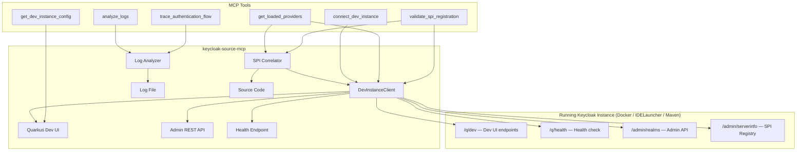

# Live Development Intelligence

## Overview

Live Development Intelligence bridges the gap between **static source analysis** and **runtime behavior** in Keycloak development. It connects to a locally running Keycloak instance — whether started via Docker, IDELauncher, or Maven — and provides real-time assistance showing what's actually loaded, how authentication flows execute, and whether custom SPI providers are correctly registered.

### Why This Matters

Keycloak developers run their customizations locally in many ways: **Docker** for quick testing, **IDELauncher** from an IDE for source-level debugging, or **Maven** for build-and-run workflows. While the existing keycloak-source-mcp tools help navigate and understand source code, they can't tell you:

- **Is my custom SPI actually loaded?** (The most common "why isn't this working?" question)
- **What exact authentication steps happened when I tested that login?**
- **Which providers are active right now and in what order?**
- **What's the running configuration for my SPI?**

Live Development Intelligence answers all of these by connecting to the running instance's management endpoints, admin API, and log output.

---

## Architecture



### Component Responsibilities

| Component | File | Role |
|-----------|------|------|
| DevInstanceClient | `src/live-dev/dev-instance-client.ts` | HTTP client for all Keycloak/Quarkus endpoints |
| Quarkus Dev UI | `src/live-dev/quarkus-dev-ui.ts` | Queries Quarkus Dev UI for extensions, config, beans |
| Log Analyzer | `src/live-dev/log-analyzer.ts` | Parses and analyzes Keycloak log files |
| SPI Correlator | `src/live-dev/spi-correlator.ts` | Matches runtime providers with source code |
| 6 Tool files | `src/live-dev/tools/*.ts` | MCP tool implementations |

---

## Prerequisites

### Running Keycloak

The feature requires a locally running Keycloak instance. There are three ways to start one:

**Option 1: Docker (simplest)**
```bash
docker run -p 8080:8080 \
  -e KC_BOOTSTRAP_ADMIN_USERNAME=admin \
  -e KC_BOOTSTRAP_ADMIN_PASSWORD=admin \
  quay.io/keycloak/keycloak:latest start-dev
```

To load custom SPI extensions, mount your provider JAR:
```bash
docker run -p 8080:8080 \
  -e KC_BOOTSTRAP_ADMIN_USERNAME=admin \
  -e KC_BOOTSTRAP_ADMIN_PASSWORD=admin \
  -v /path/to/my-provider.jar:/opt/keycloak/providers/my-provider.jar \
  quay.io/keycloak/keycloak:latest start-dev
```

> **Note:** Docker `start-dev` mode does NOT expose Quarkus Dev UI endpoints (`/q/dev`). The Admin REST API and health endpoints work normally. The `get_dev_instance_config` tool will fall back to the Admin API automatically.

**Option 2: IDELauncher (recommended for source-level development)**
1. Open the Keycloak source code in your IDE
2. Navigate to `quarkus/deployment/src/test/java/test/`
3. Find and run the `KeycloakDevModeTest` or a custom launcher class
4. Alternatively, create your own launcher:
   ```java
   public class IDELauncher {
       public static void main(String[] args) {
           io.quarkus.runtime.Quarkus.run(args);
       }
   }
   ```

**Option 3: Maven/Quarkus CLI**
```bash
cd /path/to/keycloak
./mvnw -pl quarkus/server quarkus:dev
```

### Feature Availability by Deployment Method

| Feature | Docker `start-dev` | IDELauncher / Maven |
|---------|:------------------:|:-------------------:|
| Admin REST API (`/admin/`) | ✅ | ✅ |
| Health endpoint (`/q/health`) | ✅ | ✅ |
| Provider listing & validation | ✅ | ✅ |
| Log analysis | ✅ (via `docker logs`) | ✅ (via log file) |
| Quarkus Dev UI (`/q/dev`) | ❌ | ✅ |
| Quarkus config inspection | ❌ (falls back to Admin API) | ✅ |

### Required Ports

- **8080**: Keycloak HTTP port (configurable)
- When using Docker, ensure port 8080 is mapped (`-p 8080:8080`)
- The Quarkus management endpoints (`/q/health`, `/q/dev`, `/q/info`) are available on the same port by default (IDELauncher/Maven only for `/q/dev`)

### Admin User

Ensure an admin user exists. In dev mode, Keycloak usually creates one automatically. Default credentials: `admin`/`admin`.

For Docker, set admin credentials via environment variables: `KC_BOOTSTRAP_ADMIN_USERNAME` and `KC_BOOTSTRAP_ADMIN_PASSWORD`.

---

## Configuration Reference

All configuration is via environment variables. Only `KC_DEV_URL` is required — all others have sensible defaults.

| Variable | Required | Default | Description |
|----------|----------|---------|-------------|
| `KC_DEV_URL` | Yes | — | Base URL of the running Keycloak instance |
| `KC_DEV_REALM` | No | `master` | Default realm for admin queries |
| `KC_DEV_ADMIN_USERNAME` | No | `admin` | Admin username for API access |
| `KC_DEV_ADMIN_PASSWORD` | No | `admin` | Admin password for API access |
| `KC_DEV_LOG_PATH` | No | — | Path to Keycloak log file for log analysis |

### Example Configuration

In your Cursor/VS Code `settings.json`:
```json
{
  "mcpServers": {
    "keycloak-source": {
      "command": "node",
      "args": ["/path/to/keycloak-source-mcp/dist/index.js"],
      "env": {
        "KEYCLOAK_SOURCE_PATH": "/path/to/keycloak",
        "KC_DEV_URL": "http://localhost:8080",
        "KC_DEV_ADMIN_USERNAME": "admin",
        "KC_DEV_ADMIN_PASSWORD": "admin",
        "KC_DEV_LOG_PATH": "/tmp/keycloak.log"
      }
    }
  }
}
```

### Enabling Log File Output

By default Keycloak only logs to the console. To enable file logging for the `analyze_logs` tool:

**Docker:**
```bash
# Redirect Docker logs to a file
docker logs -f <container-id> 2>&1 | tee /tmp/keycloak.log

# Or run with log file output
docker run -p 8080:8080 \
  -e KC_BOOTSTRAP_ADMIN_USERNAME=admin \
  -e KC_BOOTSTRAP_ADMIN_PASSWORD=admin \
  -e KC_LOG=file \
  -e KC_LOG_FILE=/opt/keycloak/data/log/keycloak.log \
  -v /tmp/keycloak-logs:/opt/keycloak/data/log \
  quay.io/keycloak/keycloak:latest start-dev
# Then set KC_DEV_LOG_PATH=/tmp/keycloak-logs/keycloak.log
```

**IDELauncher / Maven:**
```bash
# Option 1: Redirect console output
./mvnw quarkus:dev 2>&1 | tee /tmp/keycloak.log

# Option 2: Configure Quarkus file logging in application.properties
quarkus.log.file.enable=true
quarkus.log.file.path=/tmp/keycloak.log
```

---

## Setup Guide

### Step 1: Start Keycloak

**Docker (quickest):**
```bash
docker run -p 8080:8080 \
  -e KC_BOOTSTRAP_ADMIN_USERNAME=admin \
  -e KC_BOOTSTRAP_ADMIN_PASSWORD=admin \
  quay.io/keycloak/keycloak:latest start-dev
```

**Or from source:**
```bash
cd /path/to/keycloak
./mvnw -pl quarkus/server quarkus:dev
# Wait for "Keycloak started" message
```

### Step 2: Set Environment Variables

```bash
export KC_DEV_URL=http://localhost:8080
export KC_DEV_ADMIN_USERNAME=admin
export KC_DEV_ADMIN_PASSWORD=admin
```

### Step 3: Test the Connection

Ask your AI assistant:
> "Use connect_dev_instance to check if my Keycloak is running"

You should see a status report with the Keycloak version, SPI count, and any custom providers detected.

### Step 4: Explore

Try these prompts:
- "Show me all loaded authenticator providers"
- "Analyze the recent Keycloak logs for errors"
- "Validate my custom SPI registration"
- "What configuration is active for SPI settings?"

---

## Tool Reference

### connect_dev_instance

**Purpose:** Test the connection and get a full status report.

**Input:** None (reads from environment variables)

**Output:**
- Connection status (healthy / unreachable / auth failed)
- Keycloak and Quarkus version numbers
- SPI and provider counts
- Custom provider listing with source correlation

**Example prompt:** "Check if my Keycloak dev instance is running"

---

### get_loaded_providers

**Purpose:** List all SPI providers registered in the running instance.

**Input:**
- `spiType` (optional) — Filter by SPI type, e.g. "authenticator"
- `customOnly` (optional, default: false) — Show only non-core providers

**Output:** Structured table grouped by SPI type showing provider ID, factory class, and source status.

**Example prompts:**
- "Show me all loaded authenticator providers"
- "List only my custom providers"
- "What event listener providers are registered?"

---

### analyze_logs

**Purpose:** Read and analyze recent Keycloak log entries.

**Input:**
- `lines` (optional, default: 200) — Number of recent lines to analyze
- `filter` (optional) — Class name or keyword to filter
- `extractFlow` (optional, default: true) — Extract auth flow steps

**Output:**
- Error/warning summary
- Stack trace analysis (if any)
- Authentication flow step sequence (if detected)
- Recent activity listing

**Example prompts:**
- "Analyze the last 500 lines of Keycloak logs"
- "Show me authentication-related log entries"
- "What errors happened recently in Keycloak?"

---

### trace_authentication_flow

**Purpose:** Guide through testing an auth flow and analyze the results.

**Input:**
- `realm` (required) — Realm to trace
- `description` (required) — What you're testing, e.g. "browser login with OTP"

**Output:**
- Step-by-step guidance for triggering the flow
- Log analysis of the authentication sequence (if logs are available)
- Each authenticator step with status and timing

**Example prompt:** "Help me trace a browser login flow in the master realm"

---

### validate_spi_registration

**Purpose:** Validate that custom SPI providers are correctly set up.

**Input:**
- `customSourcePath` (optional) — Path to custom extensions source

**Output:** Validation report with ✅/⚠️/❌ status for each check:
- Factory source found in source path
- META-INF/services entry present
- Provider loaded at runtime

**Example prompt:** "Validate my custom SPI providers are correctly registered"

---

### get_dev_instance_config

**Purpose:** Show the active configuration of the running instance.

**Input:**
- `filter` (optional) — Filter by config key prefix, e.g. "kc.spi"

**Output:** Configuration properties grouped by prefix, with source and default indicators.

**Example prompts:**
- "Show me the SPI configuration of my running Keycloak"
- "What database is my Keycloak dev instance using?"

---

## How the Quarkus Dev UI Works

When Keycloak runs in Quarkus dev mode, the framework exposes additional management endpoints at `/q/`:

| Endpoint | Data |
|----------|------|
| `/q/health` | Liveness and readiness probes |
| `/q/info` | Build and runtime information |
| `/q/dev-v1/io.quarkus.quarkus-core/extensions` | Loaded Quarkus extensions |
| `/q/dev-v1/io.quarkus.quarkus-core/config` | All resolved configuration |
| `/q/dev-v1/io.quarkus.quarkus-arc/beans` | CDI beans (used by SPI factories) |

These endpoints return JSON when requested with `Accept: application/json`. They are **only available in Quarkus dev mode** (IDELauncher or Maven) — Docker `start-dev` and production builds do not expose them.

The Keycloak Admin REST API (`/admin/realms`, `/admin/serverinfo`) is always available regardless of how Keycloak is started, and provides the SPI provider registry, realm configurations, and server metadata. When Dev UI endpoints are unavailable, tools automatically fall back to the Admin API.

---

## Troubleshooting

### 1. "Live Development Intelligence is not configured"
**Cause:** `KC_DEV_URL` environment variable is not set.
**Fix:** Set `KC_DEV_URL=http://localhost:8080` in your MCP server configuration.

### 2. "Keycloak Dev Instance Not Reachable"
**Cause:** The instance isn't running or wrong URL.
**Fix:** Start Keycloak, verify the URL and port. Try `curl http://localhost:8080/q/health`. For Docker, ensure port mapping is correct (`-p 8080:8080`).

### 3. "Admin access failed"
**Cause:** Wrong admin credentials.
**Fix:** Check `KC_DEV_ADMIN_USERNAME` and `KC_DEV_ADMIN_PASSWORD`. Default is `admin`/`admin`.

### 4. "Log analysis requires KC_DEV_LOG_PATH"
**Cause:** Log file path not configured.
**Fix:** Set `KC_DEV_LOG_PATH` to your Keycloak log file. See "Enabling Log File Output" above.

### 5. No custom providers detected
**Cause:** Custom extensions JAR not on classpath.
**Fix:** For Docker, mount your JAR into `/opt/keycloak/providers/` (`-v my-provider.jar:/opt/keycloak/providers/my-provider.jar`). For IDELauncher, add it as a module dependency. For Maven, place the JAR in `quarkus/server/target/providers/`.

### 6. Source not found for custom provider
**Cause:** `KEYCLOAK_SOURCE_PATH` doesn't include custom code.
**Fix:** Set `KEYCLOAK_SOURCE_PATH` to a directory containing both Keycloak core and your custom source, or use `customSourcePath` parameter.

### 7. "Quarkus Dev UI config endpoint not available"
**Cause:** Running a production build, Docker `start-dev`, or Dev UI is disabled.
**Fix:** The Quarkus Dev UI (`/q/dev`) is only available when running from source in Quarkus dev mode (`./mvnw quarkus:dev` or IDELauncher). Docker `start-dev` does NOT expose these endpoints — this is expected. The `get_dev_instance_config` tool will automatically fall back to the Admin API.

### 8. Stack trace not detected in logs
**Cause:** Log format doesn't match expected pattern.
**Fix:** Ensure Keycloak uses the default JBoss Logging format. Custom log formatters may prevent parsing.

### 9. Auth flow analysis shows no steps
**Cause:** Authentication happened before log analysis, or logging level is too low.
**Fix:** Set `quarkus.log.category."org.keycloak.authentication".level=DEBUG` for verbose auth logging.

### 10. Connection timeout errors
**Cause:** Keycloak is still starting up or under heavy load.
**Fix:** Wait for the instance to fully start (look for "Keycloak started" in logs). Retry after a few seconds.

---

## Security Considerations

- **This feature connects to a LIVE Keycloak instance.** Only use it with development instances, never production.
- Admin credentials are passed via environment variables. Do not commit them to version control.
- The admin token is cached in memory (never written to disk) and expires automatically.
- All connections are to localhost by default. If connecting to a remote instance, ensure you use HTTPS.
- The feature never modifies the Keycloak instance — it only reads data.
- Log files may contain sensitive information (usernames, client IDs). Handle log paths carefully.

---

## Limitations and Known Edge Cases

- **Quarkus Dev UI is not available in Docker.** Docker `start-dev` does not expose `/q/dev` endpoints. Tools fall back to the Admin API automatically.
- **Quarkus Dev UI availability varies.** Some Quarkus versions organize endpoints differently. The code tries multiple known paths.
- **Log format parsing is heuristic.** Custom log formatters or non-standard Keycloak builds may produce logs that don't parse cleanly.
- **Provider classification is package-based.** A custom provider in `org.keycloak.*` package would be incorrectly classified as built-in.
- **Auth flow tracing requires manual trigger.** The tool cannot automatically initiate authentication flows for safety reasons.
- **Large log files.** Only the last N lines are read to avoid memory issues. Very long stack traces might be truncated.
- **CDI bean listing** from Quarkus Dev UI can be very large (thousands of beans). Filtering is recommended.
- **Token caching** means credential changes require a server restart to take effect in the cached token.
- **Multi-realm setups** default to the configured realm (default: `master`). Specify the realm parameter for other realms.

---

## Example Development Session

Here's how a typical development session might look:

**Developer:** "I just started Keycloak with my custom SMS authenticator. Can you check if it's loaded?"

**AI (using connect_dev_instance):**
> 🟢 Keycloak 26.0.1 is running. Found 1 custom provider:
> ✅ authenticator → SmsSenderAuthenticatorFactory (found in source)

**Developer:** "Show me all the authenticator providers"

**AI (using get_loaded_providers):**
> Lists all authenticator providers with the custom one highlighted

**Developer:** "I tried logging in but the SMS step was skipped. Can you check the logs?"

**AI (using analyze_logs):**
> Authentication Flow detected:
> 1. ▶️ auth-cookie → attempted
> 2. ✅ auth-username-password-form → success
> 3. ▶️ auth-otp-form → skipped (not configured as required)

**Developer:** "Ah, I need to make it required. What's the current config?"

**AI (using get_dev_instance_config with filter "spi"):**
> Shows SPI configuration, highlighting that the SMS authenticator is configured but set to ALTERNATIVE

**Developer:** "Validate that my SPI registration is correct"

**AI (using validate_spi_registration):**
> ✅ Factory source found
> ✅ META-INF/services entry present
> ✅ Provider loaded at runtime
